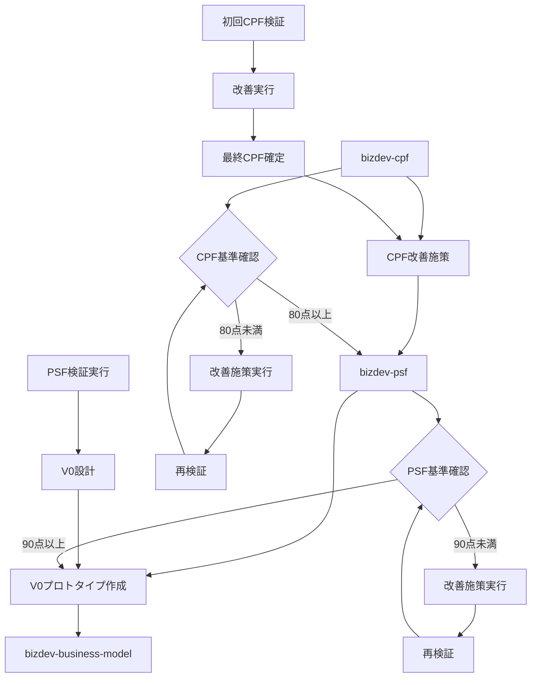
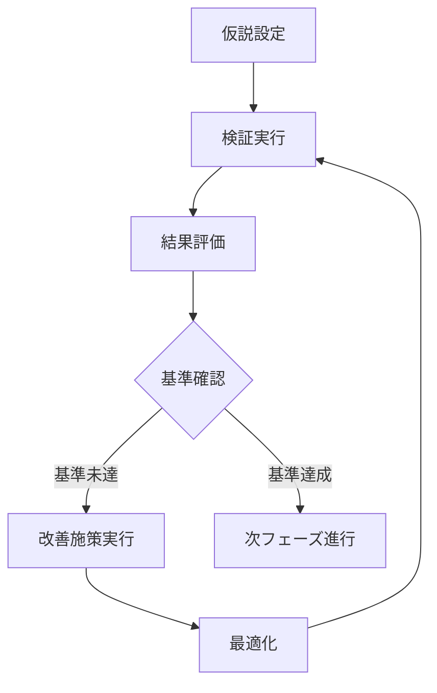
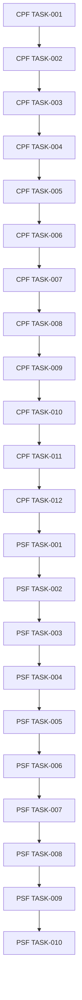

# Bizdev検証コマンド群

## 概要
事業開発における科学的検証プロセスを段階的に実行するコマンド群。BtoBtoCプラットフォームビジネスの立ち上げに特化した検証フレームワークを提供します。

- **Red-Green-Refactorサイクル** → **仮説-検証-改善-最適化サイクル**
- **受け入れ基準** → **定量化された検証基準**
- **段階的実装** → **段階的検証プロセス**

## コマンド実行フロー



## 検証基準の明確化

### CPF検証基準
- **課題の深刻度**: 8/10以上（生活・事業に深刻な影響）
- **市場規模**: 企業1,000店舗以上、消費者10万人以上
- **緊急性**: 解決を先延ばしにできない切迫感
- **支払い意欲**: 課題解決に投資する意欲と能力
- **既存解決策への不満**: 現在の代替手段では不十分

### PSF検証基準
- **価値提案の明確性**: 9/10以上（顧客が即座に理解できる）
- **解決策の実現可能性**: 8/10以上（技術的・運用的に実現可能）
- **競合優位性**: 明確な差別化ポイント
- **収益モデルの妥当性**: 持続可能な収益構造

### 反復改善プロセスの構造化



## ファイル構造

```
docs/
├── cpf/                  # CPF実行結果フォルダ
│   ├── current/          # 改善後の最新状態
│   │   ├── personas/     # 特化ペルソナ
│   │   ├── validation/   # CPF検証結果
│   │   └── hypotheses/   # 強化された仮説
│   ├── archive/          # 初回実行記録
│   ├── improvements/     # CPF改善施策（10項目）
│   └── tasks/            # CPFタスク管理
├── psf/                  # PSF実行結果フォルダ
│   ├── current/          # 最新状態
│   │   ├── validation/   # PSF検証結果
│   │   └── personas/     # 継続ペルソナ
│   ├── archive/          # 初回実行記録
│   ├── prototype/        # V0プロトタイプ設計
│   └── tasks/            # PSFタスク管理
└── archive/              # 旧構造（移行中）
```

## 使用方法

### 1.CPF検証開始
```bash
$ claude code bizdev-cpf
# プロンプト例
# 事業領域：フィットネス・ヘルスケア
# プラットフォーム利用企業（B）：小規模ジム・個人トレーナー・新規開業フィットネス
# 最終消費者（C）：20-30代会社員・運動習慣を始めたい人・継続困難な人
# 企業側の課題：会員数増加困難・設備稼働率低下・退会率高い・差別化困難
# 消費者側の課題：ジム選び迷い・継続モチベーション維持困難・時間調整・効果実感できない
# 初期仮説：AI駆動パーソナル化トレーニング推薦で継続率向上
```

#### 事業課題入力例

##### ベーカリー業界
```
事業領域：ベーカリー業界
プラットフォーム利用企業（B）：地域の小規模パン店・新規開店店舗
最終消費者（C）：共働き子育て世代、時短ニーズの高い働く親
企業側の課題：新規客獲得困難、認知度不足、売上予測困難
消費者側の課題：平日夕方の買い物時間制約、子供の好みに合う商品選び
初期仮説：焼き立て通知とタイミング最適化で双方の課題を解決
```

##### 美容・ウェルネス業界
```
事業領域：美容・ヘルスケア
プラットフォーム利用企業（B）：個人経営美容サロン、新規開業エステ
最終消費者（C）：30-40代女性、忙しい働く女性
企業側の課題：予約の空き時間、リピーター獲得、差別化困難
消費者側の課題：予約が取りにくい、サロン選びの不安、価格の不透明さ
初期仮説：リアルタイム空き時間通知と口コミ品質で課題解決
```

##### ペット・動物ケア業界
```
事業領域：ペットケア
プラットフォーム利用企業（B）：個人経営ペットサロン、動物病院
最終消費者（C）：ペット飼い主、多忙な共働き世帯
企業側の課題：新規顧客獲得、予約管理の複雑さ、リピート率向上
消費者側の課題：信頼できるサロン探し、予約の取りにくさ、価格比較困難
初期仮説：ペット情報の蓄積と最適なケア提案で信頼関係構築
```

##### 教育・学習支援業界
```
事業領域：教育・習い事
プラットフォーム利用企業（B）：個人経営塾、習い事教室
最終消費者（C）：子を持つ親、学習サポートを求める家庭
企業側の課題：生徒数確保困難、差別化ポイント不明、口コミ拡散困難
消費者側の課題：子供に合う教室選び、学習効果の不安、送迎の負担
初期仮説：学習成果の可視化と送迎サポートで親の不安解消
```

### 2.PSF検証開始  
```bash
$ commands/bizdev-README.md
$ commands/bizdev-psf.md
```

### 3.V0プロトタイプデモ作成
docs/psf/prototype/v0-prompt.md
を[V0](https://v0.dev/)にコピペして、デモを作成してください。

### 4.ビジネスモデル構築（未完成）
```bash
$ commands/bizdev-business-model.md
```

**成功する事業課題の条件**:
- ✅ **課題の深刻度**: 生活・事業に深刻な影響を与える（8/10以上）
- ✅ **市場規模**: 十分な対象者数（企業1,000店舗以上、消費者10万人以上）
- ✅ **緊急性**: 解決を先延ばしにできない切迫感
- ✅ **支払い意欲**: 課題解決に投資する意欲と能力
- ✅ **既存解決策への不満**: 現在の代替手段では不十分


## 改善サイクルの構造化

### 各フェーズでの改善サイクル
1. **仮説設定（要件定義）** - 初期仮説の構築
2. **検証実行（テスト実装）** - インタビュー・調査実施
3. **結果評価（テスト結果）** - スコアリング・分析
4. **改善施策実行（リファクタリング）** - 仮説修正・最適化
5. **再検証（品質確認）** - 改善後の再検証

### タスク分割の導入

#### CPFフェーズ（12タスク）
- **フェーズ1**: 基盤準備（2タスク）
- **フェーズ2**: 顧客分析（4タスク）
- **フェーズ3**: 体験設計（2タスク）
- **フェーズ4**: 仮説生成（2タスク）
- **フェーズ5**: 検証ツール作成（2タスク）

#### PSFフェーズ（10タスク）
- **フェーズ1**: CPF継承・基盤準備（2タスク）
- **フェーズ2**: PSF検証スクリプト作成（3タスク）
- **フェーズ3**: インタビュー実施シミュレーション（2タスク）
- **フェーズ4**: 統合分析・スコアリング（2タスク）
- **フェーズ5**: V0プロトタイプ設計（1タスク）

### 依存関係の可視化


## 利点

1. **一貫性のある検証プロセス**
   - 仮説から検証まで統一されたフロー
   - 定量化された基準による明確な判断

2. **品質の担保**
   - 科学的アプローチによる堅牢な検証
   - 包括的な改善サイクル

3. **効率的な開発**
   - 自動的なタスク分割と優先順位付け
   - 依存関係の可視化

4. **包括的なドキュメント**
   - 仮説、検証、改善が全てドキュメント化
   - 後からの参照が容易