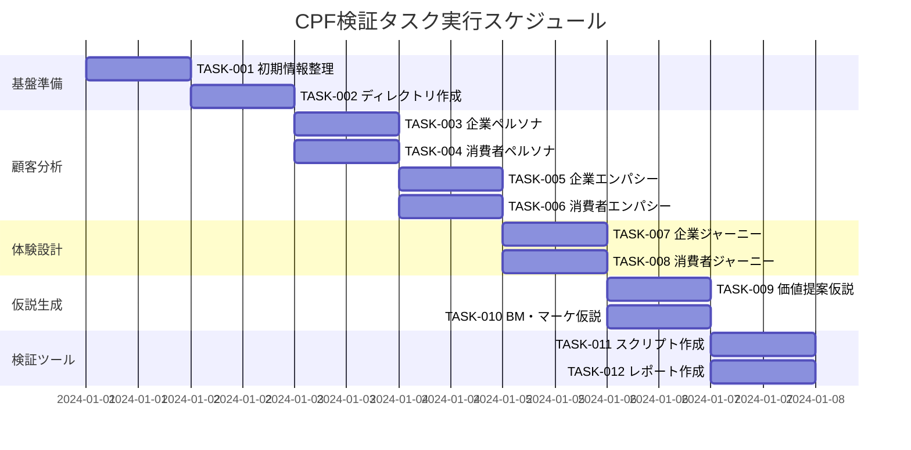

# cpf-tasks

## 目的
CPF検証の要件定義に基づいて実装タスクを分割し、依存関係を考慮した適切な順序でBtoBtoCモデルのCustomer-Problem Fit検証を実行する。

## 前提条件
- `/commands/cpf-requirements.md` で要件が定義されている
- ユーザーから事業アイデアの基本情報が提供されている
- `/docs/cpf/current/validation/` ディレクトリが存在する（なければ作成）

## 実行内容

1. **要件の確認**
   - `/commands/cpf-requirements.md` の内容確認
   - ユーザー提供情報の整理
   - BtoBtoCモデルの適用性確認

2. **タスクの洗い出し**
   - 基盤タスク（情報収集、ディレクトリ作成）
   - 分析タスク（ペルソナ、エンパシーマップ、ジャーニー）
   - 仮説生成タスク（価値提案、ビジネスモデル）
   - ドキュメント生成タスク（スクリプト、レポート、スライド）

3. **依存関係の分析**
   - タスク間の依存関係を明確化
   - 並行実行可能なタスクを識別
   - クリティカルパスを特定

4. **タスクの詳細化**
   - 各タスクの詳細な実行内容
   - 成果物とチェック項目
   - バイアス回避のための注意点

5. **ファイルの作成**
   - リスト化したタスクを `/docs/cpf/tasks/list-cpf-tasks.md` として保存
   - 進捗追跡用チェックボックス付き

## 出力フォーマット例

```markdown
# {事業領域} CPF検証実装タスク

## 概要
全タスク数: 12
推定作業時間: 6-8時間
クリティカルパス: TASK-001 → TASK-002 → TASK-003 → TASK-006 → TASK-011

## タスク一覧

### フェーズ1: 基盤準備

#### TASK-001: 初期情報整理
- [ ] **タスク完了**
- **要件リンク**: REQ-001
- **依存タスク**: なし
- **実行内容**:
  - 事業領域の明確化
  - B側企業セグメントの特定
  - C側消費者セグメントの特定
  - 課題仮説の整理
- **成果物**:
  - [ ] 事業領域が明確に定義されている
  - [ ] B側企業の特徴が整理されている
  - [ ] C側消費者の特徴が整理されている
  - [ ] 初期課題仮説が文書化されている

#### TASK-002: ディレクトリ構造作成
- [ ] **タスク完了**
- **要件リンク**: REQ-002
- **依存タスク**: TASK-001
- **実行内容**:
  - `/docs/cpf/current/validation/` ディレクトリの作成
  - `/docs/cpf/current/personas/` ディレクトリの作成
  - `/docs/cpf/current/hypotheses/` ディレクトリの作成
  - `/docs/cpf/archive/` ディレクトリの作成
  - `/docs/cpf/improvements/` ディレクトリの作成
  - `/docs/cpf/tasks/` ディレクトリの作成
- **成果物**:
  - [ ] 必要なディレクトリが作成されている
  - [ ] ディレクトリ構造が統一されている

### フェーズ2: 顧客分析

#### TASK-003: 企業側詳細ペルソナ作成
- [ ] **タスク完了**
- **要件リンク**: REQ-002
- **依存タスク**: TASK-002
- **実行内容**:
  - 企業デモグラフィック（業界、規模、年商、所在地）
  - 担当者デモグラフィック（年齢、役職、経験年数）
  - 企業行動特性（意思決定プロセス、予算サイクル）
  - 企業課題（顕在的・潜在的課題、重要度）
- **バイアス回避注意点**:
  - [ ] 理想化しすぎない現実的な設定
  - [ ] 業界の一般的な傾向を反映
  - [ ] 複数の企業タイプを考慮
- **成果物**:
  - [ ] 3-5名の企業側ペルソナが詳細に作成されている
  - [ ] 各ペルソナが現実的で検証可能である
  - [ ] `/docs/cpf/current/personas/enterprise-personas.md` に保存されている

#### TASK-004: 消費者側詳細ペルソナ作成
- [ ] **タスク完了**
- **要件リンク**: REQ-002
- **依存タスク**: TASK-002
- **実行内容**:
  - デモグラフィック（年齢、職業、年収、居住地、家族構成）
  - ライフスタイル（起床・通勤・就業・帰宅・就寝時間）
  - デジタル行動パターン（スマホ利用、SNS、情報源）
  - 経済行動（可処分所得、価格感度、支払い方法）
- **バイアス回避注意点**:
  - [ ] ステレオタイプを避けた多様性の考慮
  - [ ] 実際の統計データに基づく設定
  - [ ] 異なる年代・職業の複数パターン
- **成果物**:
  - [ ] 3-5名の消費者側ペルソナが詳細に作成されている
  - [ ] ライフスタイルが具体的で現実的である
  - [ ] `/docs/cpf/current/personas/consumer-personas.md` に保存されている

#### TASK-005: 企業側エンパシーマップ作成
- [ ] **タスク完了**
- **要件リンク**: REQ-003
- **依存タスク**: TASK-003
- **実行内容**:
  - See: 競合状況、市場動向、業界ニュース
  - Hear: 上司の要求、部下の意見、顧客の声
  - Think & Feel: 不安、期待、プレッシャー
  - Say & Do: 会議での発言、日常業務、意思決定
  - Pain: ROI不透明、競合圧力、社内調整困難
  - Gain: 効率化、売上向上、評価アップ
- **成果物**:
  - [ ] 各ペルソナのエンパシーマップが完成
  - [ ] 内面的体験が具体的に記述されている
  - [ ] `/docs/cpf/current/personas/enterprise-empathy-maps.md` に保存されている

#### TASK-006: 消費者側エンパシーマップ作成
- [ ] **タスク完了**
- **要件リンク**: REQ-003
- **依存タスク**: TASK-004
- **実行内容**:
  - See: SNS情報、広告、友人の投稿
  - Hear: 友人の会話、口コミ、レビュー
  - Think & Feel: 時間不足、選択疲れ、失敗への不安
  - Say & Do: 検索行動、比較検討、購買決定
  - Pain: 時間制約、情報過多、品質不安
  - Gain: 時短、品質向上、コスパ実現
- **成果物**:
  - [ ] 各ペルソナのエンパシーマップが完成
  - [ ] 課題の感情的側面が明確になっている
  - [ ] `/docs/cpf/current/personas/consumer-empathy-maps.md` に保存されている

### フェーズ3: 体験設計

#### TASK-007: 企業側カスタマージャーニー作成
- [ ] **タスク完了**
- **要件リンク**: REQ-004
- **依存タスク**: TASK-005
- **実行内容**:
  - 認知段階: 課題の自覚 → 情報収集 → 解決策探索
  - 検討段階: 比較検討 → 社内稟議 → 予算確保
  - 導入段階: 契約締結 → 初期設定 → 運用開始
  - 継続段階: 効果測定 → 改善要求 → 契約更新
- **BtoBtoCモデル考慮点**:
  - [ ] 消費者側の存在を前提とした検討
  - [ ] プラットフォーム効果への期待
- **成果物**:
  - [ ] 詳細なカスタマージャーニーマップ
  - [ ] 各段階での感情・行動・タッチポイント
  - [ ] `/docs/cpf/current/personas/enterprise-customer-journey.md` に保存されている

#### TASK-008: 消費者側カスタマージャーニー作成
- [ ] **タスク完了**
- **要件リンク**: REQ-004
- **依存タスク**: TASK-006
- **実行内容**:
  - 認知段階: 課題の気づき → 情報収集 → 選択肢発見
  - 検討段階: 比較検討 → 口コミ確認 → 試用検討
  - 利用段階: 初回利用 → 継続利用 → 習慣化
  - 推奨段階: 満足度向上 → 他者推奨 → ロイヤル化
- **BtoBtoCモデル考慮点**:
  - [ ] 企業経由でのサービス利用体験
  - [ ] 間接的な価値提供の認識
- **成果物**:
  - [ ] 詳細なカスタマージャーニーマップ
  - [ ] デジタル・オフライン両方のタッチポイント
  - [ ] `/docs/cpf/current/personas/consumer-customer-journey.md` に保存されている

### フェーズ4: 仮説生成

#### TASK-009: 価値提案仮説生成
- [ ] **タスク完了**
- **要件リンク**: REQ-005
- **依存タスク**: TASK-007, TASK-008
- **実行内容**:
  - 企業側への価値提案（3-5つの仮説）
  - 消費者側への価値提案（3-5つの仮説）
  - BtoBtoCプラットフォームの独自価値
- **検証可能性確保**:
  - [ ] 測定可能な価値を定義
  - [ ] 競合との差別化ポイント明確化
- **成果物**:
  - [ ] 具体的で検証可能な価値提案仮説
  - [ ] `/docs/cpf/current/hypotheses/value-propositions.md` に保存されている

#### TASK-010: ビジネスモデル・マーケティング仮説生成
- [ ] **タスク完了**
- **要件リンク**: REQ-005
- **依存タスク**: TASK-009
- **実行内容**:
  - 収益モデルの選択肢
  - チキンエッグ問題の解決策
  - ネットワーク効果の活用方法
  - 企業・消費者獲得戦略
  - 初期ユーザー獲得の順序
- **成果物**:
  - [ ] 複数のビジネスモデル案
  - [ ] マーケティング戦略仮説
  - [ ] `/docs/cpf/current/hypotheses/business-model.md` に保存されている

### フェーズ5: 検証ツール作成

#### TASK-011: インタビュースクリプト作成
- [ ] **タスク完了**
- **要件リンク**: REQ-401, REQ-402, REQ-403
- **依存タスク**: TASK-010
- **実行内容**:
  - スクリーニング質問（企業側4問・消費者側4問）
  - 企業向けインタビュースクリプト（6フェーズ構成）
  - 消費者向けインタビュースクリプト（6フェーズ構成）
  - 観察ポイント（バイアス回避）
  - インタビュー後記録フォーマット
- **バイアス回避要件**:
  - [ ] 誘導質問を徹底回避
  - [ ] 中立的な質問文言
  - [ ] 確証バイアス防止措置
- **成果物**:
  - [ ] `/docs/cpf/current/validation/cpf-interview-script.md`
  - [ ] 実用的で中立的なインタビューガイド

#### TASK-012: 検証レポート・スライドテンプレート作成
- [ ] **タスク完了**
- **要件リンク**: REQ-001-005
- **依存タスク**: TASK-011
- **実行内容**:
  - 統合CPF検証レポートテンプレート
  - CPF要点サマリースライド（Marp形式）
  - スコアリング基準とフォーマット
- **成果物**:
  - [ ] `/docs/cpf/current/validation/cpf-validation-report.md`
  - [ ] `/docs/cpf/current/validation/cpf-summary-slides.md`
  - [ ] インタビュー結果の統合分析フレームワーク

## 実行順序



## 並行実行可能なタスク

### 同時実行可能
- TASK-003 ＆ TASK-004（ペルソナ作成）
- TASK-005 ＆ TASK-006（エンパシーマップ）
- TASK-007 ＆ TASK-008（ジャーニーマップ）
- TASK-009 ＆ TASK-010（仮説生成）
- TASK-011 ＆ TASK-012（ツール作成）

### クリティカルパス
TASK-001 → TASK-002 → TASK-003 → TASK-005 → TASK-007 → TASK-009 → TASK-011

## 進捗管理機能

### 自動進捗追跡
各タスク完了時に以下の手順でチェックボックスを更新：
1. `/docs/cpf/tasks/list-cpf-tasks.md` を読み込み
2. 完了したタスクの `- [ ]` を `- [x]` に変更
3. 進捗状況（完了率）を自動計算
4. 次回更新日時を記録

### 進捗計算式
```bash
# 完了率計算
COMPLETED_TASKS=$(grep -c "\[x\]" /docs/cpf/tasks/list-cpf-tasks.md)
TOTAL_TASKS=12
COMPLETION_RATE=$((COMPLETED_TASKS * 100 / TOTAL_TASKS))
echo "進捗状況: ${COMPLETION_RATE}% (${COMPLETED_TASKS}/${TOTAL_TASKS})"
```

### 進捗レポート生成
```bash
# 進捗レポート作成
echo "# CPF検証進捗レポート" > /docs/cpf/tasks/progress-report.md
echo "更新日時: $(date)" >> /docs/cpf/tasks/progress-report.md
echo "完了率: ${COMPLETION_RATE}%" >> /docs/cpf/tasks/progress-report.md
echo "完了タスク数: ${COMPLETED_TASKS}/${TOTAL_TASKS}" >> /docs/cpf/tasks/progress-report.md
```

## エラーハンドリング

### CPFスコア80点未満時の再実行ロジック
```bash
# CPFスコア確認
CPF_SCORE=$(grep -o "CPF総合評価：[0-9]*/100" /docs/cpf/current/validation/cpf-validation-report.md | grep -o "[0-9]*")

if [ "$CPF_SCORE" -lt 80 ]; then
    echo "CPFスコアが80点未満（${CPF_SCORE}点）のため、再実行を開始します..."
    
    # タイムスタンプ付きアーカイブディレクトリ作成
    TIMESTAMP=$(date +%Y%m%d_%H%M%S)
    ARCHIVE_DIR="/docs/cpf/archive/${TIMESTAMP}_current"
    mkdir -p "$ARCHIVE_DIR"
    
    # 現在の結果をアーカイブに移動
    if [ -d "/docs/cpf/current" ]; then
        mv /docs/cpf/current/* "$ARCHIVE_DIR/"
        echo "現在の結果を $ARCHIVE_DIR にアーカイブしました"
    fi
    
    # 改善施策の実行
    echo "改善施策の分析と実行を開始します..."
    # 改善施策の実行ロジックを呼び出し
    
else
    echo "CPFスコアが80点以上（${CPF_SCORE}点）のため、PSFフェーズに進行可能です"
fi
```

### 改善施策の自動実行
1. **前回結果の分析**
   - `/docs/cpf/archive/${TIMESTAMP}_current/validation/cpf-validation-report.md` を読み込み
   - 課題の深刻度・普遍性・解決意欲を分析
   - 改善ポイントを特定

2. **改善施策の実行**
   - ターゲットセグメントの再定義
   - 価値提案の強化
   - 価格戦略の最適化
   - 競合分析の深化

3. **新しい仮説の構築**
   - 改善されたペルソナ作成
   - 更新されたエンパシーマップ作成
   - 最適化されたカスタマージャーニー作成

### アーカイブ処理の自動化
```bash
# アーカイブ処理
archive_current_results() {
    TIMESTAMP=$(date +%Y%m%d_%H%M%S)
    ARCHIVE_DIR="/docs/cpf/archive/${TIMESTAMP}_current"
    mkdir -p "$ARCHIVE_DIR"
    
    if [ -d "/docs/cpf/current" ]; then
        mv /docs/cpf/current/* "$ARCHIVE_DIR/"
        echo "現在の結果を $ARCHIVE_DIR にアーカイブしました"
        return 0
    else
        echo "アーカイブ対象ディレクトリが存在しません"
        return 1
    fi
}
```

## バイアス回避チェックリスト

### 各タスク共通
- [ ] 確証バイアス回避：反証を積極的に探す
- [ ] 社会的望ましさバイアス回避：匿名性を保証
- [ ] アンカリングバイアス回避：複数の視点を検討
- [ ] 代表性バイアス回避：多様なサンプルを考慮

### インタビュー設計時
- [ ] 誘導質問を徹底回避
- [ ] 開放的質問を中心とする
- [ ] 沈黙を恐れず回答者に考える時間を与える
- [ ] 具体例や体験談を重視する

## 品質保証基準

### ペルソナ品質
- [ ] 実在する人物像として説得力がある
- [ ] 統計データや市場調査に基づいている  
- [ ] ステレオタイプを避けている
- [ ] 検証可能な特徴を含んでいる

### インタビュースクリプト品質
- [ ] 中立的で誘導的でない質問文
- [ ] 論理的な質問順序
- [ ] 適切な時間配分
- [ ] バイアス回避の観察ポイント明記

## 実行後の確認
- 全12タスクの完了確認
- 成果物の品質チェック
- バイアス回避施策の実装確認
- 次フェーズ（PSF）への準備状況確認