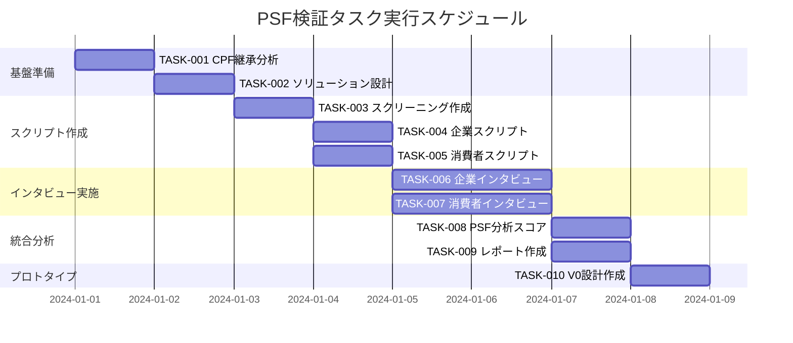

# psf-tasks

## 目的
PSF検証の要件定義に基づいて実装タスクを分割し、CPF検証結果を継承しながらBtoBtoCモデルのProblem-Solution Fit検証を体系的に実行する。

## 前提条件
- `/commands/psf-requirements.md` で要件が定義されている
- CPF検証が完了し、企業側・消費者側共に80点以上のスコアを獲得済み
- `/docs/cpf/current/validation/cpf-validation-report.md` が存在する
- CPF検証で作成されたペルソナ（企業5名・消費者5名）が利用可能

## 実行内容

1. **CPF結果の分析**
   - CPF検証結果の詳細確認
   - ペルソナ継続性の検証
   - 検証済み課題の深掘り分析

2. **タスクの洗い出し**
   - 基盤タスク（CPF継承、ソリューション設計）
   - 検証タスク（スクリプト作成、インタビュー実施）
   - 分析タスク（統合分析、スコアリング）
   - プロトタイプタスク（V0設計、デモ戦略）

3. **依存関係の分析**
   - タスク間の依存関係を明確化
   - 並行実行可能なタスクを識別
   - クリティカルパスを特定

4. **ファイルの作成**
   - リスト化したタスクを `/docs/psf/tasks/list-psf-tasks.md` として保存
   - 進捗追跡用チェックボックス付き

## 出力フォーマット例

```markdown
# {事業領域} PSF検証実装タスク

## 概要
全タスク数: 10
推定作業時間: 8-10時間
クリティカルパス: TASK-001 → TASK-003 → TASK-005 → TASK-008 → TASK-010

## タスク一覧

### フェーズ1: CPF継承・基盤準備

#### TASK-001: CPF結果分析・継承
- [ ] **タスク完了**
- **要件リンク**: REQ-001
- **依存タスク**: なし（CPF完了が前提）
- **実行内容**:
  - CPF検証レポートの詳細分析
  - 企業側・消費者側ペルソナ（各5名）の確認
  - 検証済み課題の深掘り整理
  - CPFスコア80点以上の確認
  - BtoBtoCモデル特有課題の再確認
- **成果物**:
  - [ ] CPF結果サマリーが作成されている
  - [ ] 継続ペルソナ10名の詳細が整理されている
  - [ ] 検証済み課題リストが作成されている
  - [ ] PSF検証の前提条件が満たされている

#### TASK-002: ソリューション仮説構築
- [ ] **タスク完了**
- **要件リンク**: REQ-002
- **依存タスク**: TASK-001
- **実行内容**:
  - 企業向けソリューション機能の詳細設計
  - 消費者向けソリューション機能の詳細設計
  - プラットフォーム全体価値提案の定義
  - 技術的実現可能性の初期評価
  - 競合分析とポジショニング
- **BtoBtoCモデル考慮点**:
  - [ ] チキンエッグ問題への対処策
  - [ ] 両側市場への同時価値提供
  - [ ] ネットワーク効果の活用方法
- **成果物**:
  - [ ] 企業向けソリューション機能リスト
  - [ ] 消費者向けソリューション機能リスト
  - [ ] プラットフォーム価値提案書
  - [ ] 技術的実現可能性レポート

### フェーズ2: PSF検証スクリプト作成

#### TASK-003: スクリーニング質問作成
- [ ] **タスク完了**
- **要件リンク**: REQ-003
- **依存タスク**: TASK-002
- **実行内容**:
  - 企業側スクリーニング質問（4問）作成
  - 消費者側スクリーニング質問（4問）作成
  - 対象者絞り込み基準の設定
  - 除外基準の明確化
- **バイアス回避注意点**:
  - [ ] 誘導質問を避けた中立的設問
  - [ ] 回答者の社会的望ましさバイアス軽減
  - [ ] 具体的行動・経験に基づく質問
- **成果物**:
  - [ ] 企業側スクリーニング質問4問
  - [ ] 消費者側スクリーニング質問4問
  - [ ] 対象者選定基準書
  - [ ] 質問の妥当性検証記録

#### TASK-004: 企業向けPSFインタビュースクリプト作成
- [ ] **タスク完了**
- **要件リンク**: REQ-003
- **依存タスク**: TASK-003
- **実行内容**:
  - Phase 1: 現状再確認（5分）スクリプト
  - Phase 2: ソリューション提示（12分）スクリプト
  - Phase 3: 価値検証（10分）スクリプト
  - Phase 4: 導入検討（8分）スクリプト
  - 観察ポイントとバイアス回避策
- **企業特有考慮点**:
  - [ ] 意思決定プロセスの複雑性
  - [ ] ROI・コスト感度
  - [ ] 既存システムとの統合要件
  - [ ] 社内承認プロセス
- **成果物**:
  - [ ] 4フェーズ構成の詳細スクリプト
  - [ ] 観察ポイントチェックリスト
  - [ ] 中立的質問の検証記録

#### TASK-005: 消費者向けPSFインタビュースクリプト作成
- [ ] **タスク完了**
- **要件リンク**: REQ-003
- **依存タスク**: TASK-003
- **実行内容**:
  - Phase 1: 現状確認（5分）スクリプト
  - Phase 2: ソリューション体験（15分）スクリプト
  - Phase 3: 価値認識（8分）スクリプト
  - Phase 4: 利用意向（7分）スクリプト
  - 消費者特有のバイアス回避策
- **消費者特有考慮点**:
  - [ ] 価格感度とフリーミアム期待
  - [ ] プライバシー懸念
  - [ ] 操作の直感性重視
  - [ ] 社会的影響（友人・家族の意見）
- **成果物**:
  - [ ] 4フェーズ構成の詳細スクリプト
  - [ ] 消費者行動観察ポイント
  - [ ] プライバシー配慮事項

### フェーズ3: インタビュー実施シミュレーション

#### TASK-006: 企業側PSFインタビュー実施（5名）
- [ ] **タスク完了**
- **要件リンク**: REQ-004
- **依存タスク**: TASK-004
- **実行内容**:
  - CPFから継続する企業側対象者5名とのインタビュー
  - 現実的な反応分布（肯定30%、中立40%、否定30%）
  - ソリューション評価とフィードバック収集
  - 導入障壁と価格感度の詳細分析
- **現実的シミュレーション要件**:
  - [ ] 楽観的すぎない反応設定
  - [ ] 実際の組織制約を反映
  - [ ] 具体的な懸念事項の表現
  - [ ] 導入決定プロセスの複雑さ
- **成果物**:
  - [ ] 5名分の詳細インタビュー記録
  - [ ] ソリューション評価集計
  - [ ] 導入障壁分析レポート
  - [ ] 価格感度分析結果

#### TASK-007: 消費者側PSFインタビュー実施（5名）
- [ ] **タスク完了**
- **要件リンク**: REQ-004
- **依存タスク**: TASK-005
- **実行内容**:
  - CPFから継続する消費者側対象者5名とのインタビュー
  - 現実的な反応分布の適用
  - ユーザビリティとUX評価
  - 利用継続意向と価格受容性分析
- **消費者行動現実性**:
  - [ ] 新サービスへの慎重姿勢
  - [ ] 無料期間への依存傾向
  - [ ] 友人・口コミ影響の重視
  - [ ] プライバシー懸念の表現
- **成果物**:
  - [ ] 5名分の詳細インタビュー記録
  - [ ] UX・ユーザビリティ評価
  - [ ] 利用意向分析結果
  - [ ] 価格受容性分析

### フェーズ4: 統合分析・スコアリング

#### TASK-008: PSF統合分析・スコアリング
- [ ] **タスク完了**
- **要件リンク**: REQ-005
- **依存タスク**: TASK-006, TASK-007
- **実行内容**:
  - 企業側PSFスコア算出（100点満点）
  - 消費者側PSFスコア算出（100点満点）
  - BtoBtoCプラットフォーム統合評価
  - 機能別評価とMVP要件整理
  - 競合優位性分析
- **スコアリング基準**:
  - [ ] 課題解決の的確性（25点）
  - [ ] ソリューションの受容性（25点）
  - [ ] 競合優位性（25点）
  - [ ] 実装可能性（25点）
- **成果物**:
  - [ ] 企業側PSFスコア算出結果
  - [ ] 消費者側PSFスコア算出結果
  - [ ] BtoBtoCプラットフォーム統合評価
  - [ ] MVP機能優先順位リスト

#### TASK-009: 統合レポート・スライド作成
- [ ] **タスク完了**
- **要件リンク**: REQ-001-005
- **依存タスク**: TASK-008
- **実行内容**:
  - PSF検証統合レポート作成
  - PSF要点サマリースライド作成（Marp形式）
  - 意思決定支援資料の整備
  - ステークホルダー向け要約資料
- **成果物**:
  - [ ] `/docs/psf/current/validation/psf-validation-report.md`
  - [ ] `/docs/psf/current/validation/psf-interview-script.md`
  - [ ] `/docs/psf/current/validation/psf-summary-slides.md`
  - [ ] 意思決定支援サマリー

### フェーズ5: V0プロトタイプ設計

#### TASK-010: V0プロトタイプデモ設計プロンプト作成
- [ ] **タスク完了**
- **要件リンク**: REQ-006
- **依存タスク**: TASK-009
- **実行内容**:
  - PSF検証結果に基づくペルソナ別UI設計
  - 企業5パターン・消費者5パターンのインターフェース
  - 導入障壁を解決するUX要素の具体的実装
  - BtoBtoC統合価値の視覚的表現
  - V0.dev実装用技術仕様
- **プロトタイプ設計要件**:
  - [ ] 各ペルソナの具体的要件反映
  - [ ] 導入障壁対策のUX実装
  - [ ] セキュリティ・信頼性の視覚表現
  - [ ] 段階的導入プロセスの表現
- **成果物**:
  - [ ] `/docs/psf/prototype/v0-prompt.md`
  - [ ] ペルソナ別UI設計仕様
  - [ ] 導入障壁対策UX仕様
  - [ ] V0技術実装ガイド

## 実行順序



## 並行実行可能なタスク

### 同時実行可能
- TASK-004 ＆ TASK-005（スクリプト作成）
- TASK-006 ＆ TASK-007（インタビュー実施）
- TASK-008 ＆ TASK-009（分析・レポート作成の一部）

### クリティカルパス
TASK-001 → TASK-002 → TASK-003 → TASK-004 → TASK-006 → TASK-008 → TASK-010

## 進捗管理機能

### 自動進捗追跡
各タスク完了時に以下の手順でチェックボックスを更新：
1. `/docs/psf/tasks/list-psf-tasks.md` を読み込み
2. 完了したタスクの `- [ ]` を `- [x]` に変更
3. 進捗状況（完了率）を自動計算
4. 次回更新日時を記録

### 進捗計算式
```bash
# 完了率計算
COMPLETED_TASKS=$(grep -c "\[x\]" /docs/psf/tasks/list-psf-tasks.md)
TOTAL_TASKS=10
COMPLETION_RATE=$((COMPLETED_TASKS * 100 / TOTAL_TASKS))
echo "進捗状況: ${COMPLETION_RATE}% (${COMPLETED_TASKS}/${TOTAL_TASKS})"
```

### 進捗レポート生成
```bash
# 進捗レポート作成
echo "# PSF検証進捗レポート" > /docs/psf/tasks/progress-report.md
echo "更新日時: $(date)" >> /docs/psf/tasks/progress-report.md
echo "完了率: ${COMPLETION_RATE}%" >> /docs/psf/tasks/progress-report.md
echo "完了タスク数: ${COMPLETED_TASKS}/${TOTAL_TASKS}" >> /docs/psf/tasks/progress-report.md
```

## エラーハンドリング

### PSFスコア80点未満時の再実行ロジック
```bash
# PSFスコア確認
PSF_SCORE=$(grep -o "PSF総合評価：[0-9]*/100" /docs/psf/current/validation/psf-validation-report.md | grep -o "[0-9]*")

if [ "$PSF_SCORE" -lt 80 ]; then
    echo "PSFスコアが80点未満（${PSF_SCORE}点）のため、再実行を開始します..."
    
    # タイムスタンプ付きアーカイブディレクトリ作成
    TIMESTAMP=$(date +%Y%m%d_%H%M%S)
    ARCHIVE_DIR="/docs/psf/archive/${TIMESTAMP}_current"
    mkdir -p "$ARCHIVE_DIR"
    
    # 現在の結果をアーカイブに移動
    if [ -d "/docs/psf/current" ]; then
        mv /docs/psf/current/* "$ARCHIVE_DIR/"
        echo "現在の結果を $ARCHIVE_DIR にアーカイブしました"
    fi
    
    # 改善施策の実行
    echo "改善施策の分析と実行を開始します..."
    # 改善施策の実行ロジックを呼び出し
    
else
    echo "PSFスコアが80点以上（${PSF_SCORE}点）のため、V0プロトタイプ作成フェーズに進行可能です"
fi
```

### 改善施策の自動実行
1. **前回結果の分析**
   - `/docs/psf/archive/${TIMESTAMP}_current/validation/psf-validation-report.md` を読み込み
   - ソリューション評価・導入障壁を分析
   - 改善ポイントを特定

2. **改善施策の実行**
   - ソリューション機能の再設計
   - 価格戦略の見直し
   - UX/UIの改善

3. **新しい仮説の構築**
   - 改善されたソリューション設計
   - 更新されたインタビュースクリプト
   - 最適化されたプロトタイプ設計

### アーカイブ処理の自動化
```bash
# アーカイブ処理
archive_current_results() {
    TIMESTAMP=$(date +%Y%m%d_%H%M%S)
    ARCHIVE_DIR="/docs/psf/archive/${TIMESTAMP}_current"
    mkdir -p "$ARCHIVE_DIR"
    
    if [ -d "/docs/psf/current" ]; then
        mv /docs/psf/current/* "$ARCHIVE_DIR/"
        echo "現在の結果を $ARCHIVE_DIR にアーカイブしました"
        return 0
    else
        echo "アーカイブ対象ディレクトリが存在しません"
        return 1
    fi
}
```

## PSFスコアリング詳細

### 企業側PSFスコア（100点満点）

#### 1. 課題解決の的確性（25点）
- 特定課題への直接的解決度（10点）
- 根本原因への対処度（8点）
- 期待効果の実現可能性（7点）

#### 2. ソリューションの受容性（25点）
- 使いやすさとlearning curve（9点）
- 既存ワークフローへの適合性（8点）
- 導入障壁の低さ（8点）

#### 3. 競合優位性（25点）
- 既存解決策に対する優位性（10点）
- 差別化ポイントの明確性（8点）
- 競合対抗の困難度（7点）

#### 4. 実装可能性（25点）
- 技術的実現可能性（8点）
- 予算・リソース適合性（9点）
- 導入タイムラインの現実性（8点）

### 消費者側PSFスコア（100点満点）
同様の4基準で評価、消費者特有要素を考慮：

#### 1. 課題解決の的確性（25点）
- 日常課題への直接的解決度
- 時間・労力削減効果
- 満足度向上の実現可能性

#### 2. ソリューションの受容性（25点）
- 操作の直感性
- 学習コストの低さ
- 利用継続の容易性

#### 3. 競合優位性（25点）
- 既存手段に対する優位性
- ユニークな価値提案
- 代替困難性

#### 4. 実装可能性（25点）
- 技術的親しみやすさ
- 価格受容性
- プライバシー・セキュリティ懸念

## バイアス回避チェックリスト

### PSF特有のバイアス回避
- [ ] ソリューション愛着バイアス：機能に固執せず課題解決を優先
- [ ] 技術バイアス：技術的可能性より顧客価値を重視
- [ ] プロダクト完璧主義：MVPレベルでの価値検証に集中

### インタビュー実施時
- [ ] 誘導質問の回避：「どう思いますか？」型の開放質問
- [ ] 確証バイアス回避：否定的意見も積極的に収集
- [ ] 社会的望ましさバイアス回避：匿名性の保証と正直回答の促進

## V0プロトタイプ設計要件

### ペルソナ別UI設計
- [ ] 企業5名：各ペルソナの業務要件を反映したダッシュボード
- [ ] 消費者5名：各ペルソナの利用シーンを考慮したインターフェース
- [ ] 導入障壁対策：セキュリティ表示、学習支援、段階的機能開放

### 技術実装要件
- [ ] V0.devで実装可能な技術スタック
- [ ] レスポンシブデザイン対応
- [ ] アクセシビリティ考慮
- [ ] 投資家プレゼン向けのデモ動線

## 品質保証基準

### インタビュースクリプト品質
- [ ] バイアスフリーな質問設計
- [ ] 現実的な時間配分
- [ ] 段階的な深掘り構造
- [ ] 観察ポイントの明確化

### 分析結果品質
- [ ] 客観的なスコアリング基準
- [ ] 根拠の明確な評価
- [ ] 実行可能な改善提案
- [ ] 意思決定支援情報の充実

## 実行後の確認
- 全10タスクの完了確認
- PSFスコアの算出と判定
- V0プロトタイプ設計の完成
- 次フェーズ（ビジネスモデル構築またはピボット）への準備確認